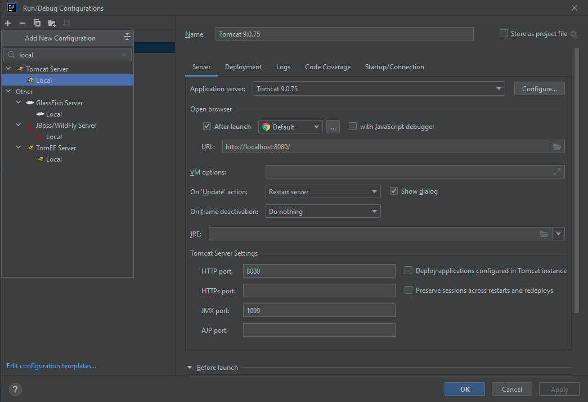

# Cinema-app
It`s a restfull web application which imitates the work of movie services, 
such as buying tickets, searching for current movies in rental, viewing the history of purchases, 
as well as registration and authentication, the application also has a division of beneficiaries into roles.
# Application functionality
1) For the following endpoints you can register, authorize or log out from the system
   - /register 
   - /login
   - /logout
2) To see the list of available movie halls you can send a get request to /cinema-halls, to create a hall you need to send a post request to the same endpoint, but only if you have admin access rights and also pass in JSON format an object that will represent your hall.    
3) To view the list of all movies or to add a new one, the same rules work as for movie halls, except that the endpoint is located at the address /movies.
4) In order to view movie sessions, you need to be logged in, and the role is not important, but such functions as add modify or delete a session are available only to the admin, all these functions have the following endpoints
   - /movie-sessions - POST method to add new movie-session
   - /movie-sessions/available - GET method to se list of all avaible movie-sessions
   - /movie-sessions/{id} - PUT/DELETE methods to update or delete movie-session by id
5) In order to place an order or view your order history, you must be an authorized user and request the following resources:
   - /orders - GET method in order to view your order history
   - /orders/complete - Post method to confirm the purchase
6) To add tickets to the cart and also to view it there are 2 endpoints, for access to which you also need to be authorized.
   - /shopping-carts/movie-sessions - PUT method to add ticket to cart
   - /shopping-carts/by-user GET method to view cart contents
7) The administrator can also view user information using the /users/by-email endpoint.
# Project Structure
There are some important packages here
   - config package - has classes that describe the configuration of the project as well as the creation of certain bins.
   - controller package - describes units that handle HTTP
   - dao package - describes interfaces and their implementation for CRUD operations on objects.
   - dto package - describes objects that will be received or sent as a response in JSON format.
   - exception package - describes custom exceptions that may occur during program execution.
   - lib package - has the implementation of mail and password validation with the help of annotations.
   - model package - describes entities that will be stored in our database.
   - service package - describes the interfaces and their implementation to fulfill the business logic, the service layers actively use the dao layer, in turn as a layer of controllers will use its services.
   - Utility package - describes a class that stores the time date format, as well as a class that saves certain values into our database at application startup.
   - resource package - stores one file in which you need to set your database settings.
# Technologies used:
   - Java
   - Spring framework
   - Spring Security
   - Hibernate
   - MySQL
   - Maven
# How to run
1) Clone this project from GitHub
2) Install Apache Tomcat version 9.x.x.
3) Install Postman for sending requests
4) Create an empty database using your Database Management Systems.
5) Open the project in your IDE, db.properties file should contain the database connection settings, please fill all of them

6) Add new Tomcat local server configuration to your project, in Application server field specify the path to your tomcat:

7) Run the project